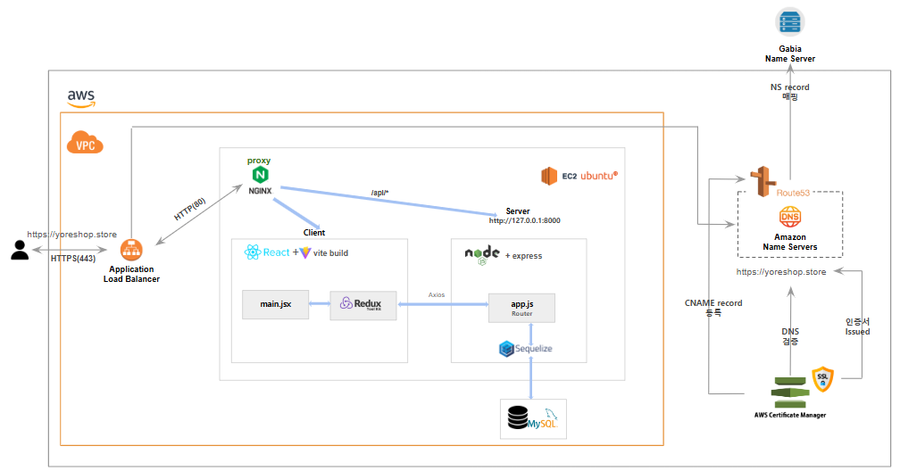
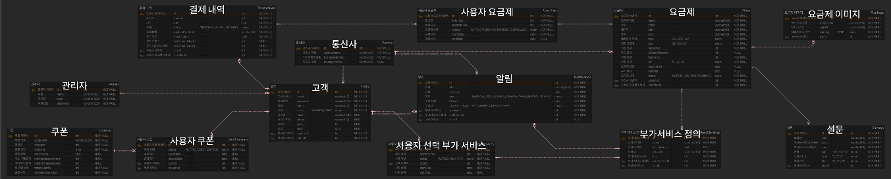

# YORE_frontend

   

## YORE, 요리: 요금제 리서치 & 리워드

휴대폰 요금제 추천, 리서치 & 리워드 핀테크 사이트

## 개발기간

25.08.20 ~ 25.09.22

## 소개

요금제 비교, 분석, 추천 결제 서비스 사이트가 하나뿐이라고?

[경쟁사](https://www.moyoplan.com)

-  **경쟁사 단점**

   -  💬기간 할인 요금제 이후의 가격 상승
   -  💬사용량 조회/요금 청구의 불확실성 / 복잡함
   -  💬고객센터 대응 / 서비스 속도

-  **YORE MVP 모델**

   -  💬각 요금제에 따른 1년 치 계산을 한 번에
   -  💬내 정보에서 내 요금제, 내 청구서 확인 가능
   -  💬카카오톡 AI, 자동 응답 활용

-  **🎉요리: 요금제 리서치 & 리워드 탄생 (YORE: 요금제 Research & Reward)**

---

## 팀원 소개

| 이름   | 역할                                                                | GitHub                                     |
| ------ | ------------------------------------------------------------------- | ------------------------------------------ |
| 황민영 | 팀장(풀스택, 요금제 / 요금제 가입 및 결제 / 알람 )                  | [github](https://github.com/wainou06)      |
| 전준모 | 팀원(풀스택, 카카오 연동 / 로그인 / 회원가입 및 내 정보)            | [github](https://github.com/aggawa)        |
| 차민준 | 팀원(풀스택, 관리자 대시보드(통계 및 사용자, 요금제 관리) / 모달창) | [github](https://github.com/blessserenity) |

---

## 기술 스택

-  **🖥 Front-end (React v18.2.0)**

   -  **React, React DOM**: UI 라이브러리
   -  **React Router DOM**: 라우팅 처리
   -  **React Toolkit, React-Redux**: 전역 상태 관리
   -  **Bootstrap, Bootstrap Icons**: UI 스타일링 및 컴포넌트
   -  **React Slick, Slick Carousel, Swiper**: 슬라이더 / 캐러셀 UI
   -  **React Toastify**: 알림(Toast) 관리
   -  **FontAwesome**: 아이콘 관리
   -  **Axios**: API 요청 처리

-  **🛠 Back-end (Node.js v22.11.0)**

   -  **Express**: 웹 프레임워크
   -  **Jsonwebtoken**: JWT 발급 및 검증
   -  **passport, passport-local, passport-jwt**: 로컬 및 JWT 기반 인증
   -  **bcrypt / bcryptjs**: 비밀번호 해싱
   -  **express-session, cookie-parser**: 세션 및 쿠키 관리
   -  **helmet**: 보안 헤더 설정
   -  **dotenv**: 환경 변수 관리
   -  **cors**: CORS 정책 설정
   -  **node-cron**: 스케줄링 작업

-  **🗄 Database (MySQL)**

   -  **MySQL**: 관계형 데이터베이스
   -  **Sequelize ORM**: 데이터 모델링 및 쿼리 추상화
   -  **Sequelize CLI (Seeders)**: 초기 데이터 (쿠폰, 관리자, 기본 사용자 / 기업) 자동 생성 및 관리

-  **🌐 Deploy**

   -  **AWS EC2 Ubuntu**: 백엔드, 프론트엔드 배포
   -  **AWS RDS**: MySQL 배포
   -  **Nginx**: proxy 설정

---

### **🥳 회원가입**

-  **중복 확인**

   -  **이메일과 닉네임**: 이메일 중복일시 회원가입을 진행할 수 없도록 하여 중복을 막도록 했습니다.

-  **유효성 검사**

   -  **유효성 검사**: 이메일 입력시 이메일 형식이 아닐 경우 회원가입이 불가하고, 비밀번호 입력시 6자리 이상이 아니라면 회원가입이 불가능하도록 했습니다.

### **👤 로그인**

-  **로그인**

   -  **로그인**: 로그인시 DB에 저장된 회원 정보와 비교하여 일치시 로그인을 일치하지 않을시 상황에 맞는 오류 메세지를 보여줍니다.

-  **카카오 연동 로그인**

   -  **카카오 연동 로그인**: 카카오 연동 로그인시 Kakao Oauth 2.0을 기반으로 인증을 합니다. Kakao에서 제공하는 프로필, 닉네임 정보를 기반으로 서비스 내 사용자 계정을 자동 생성 및 로그인 처리 합니다.

-  **이메일 저장**

   -  **이메일 저장**: 이메일 저장 체크박스 체크시 로그인 후 다음 로그인 때 텍스트 필드에 아이디가 저장됩니다.

-  **임시 비밀번호 생성**

   -  **이메일, 휴대폰 번호로 생성**: 이메일 혹은 휴대폰 번호를 사용해 임시 비밀번호를 받을 수 있습니다.

### **✍️ 내 정보 관리**

-  **프로필 정보 수정**

   -  **프로필 정보 수정**: 내 프로필 수정 시 비밀번호, 이메일, 생일을 수정할 수 있습니다. 수정 시 DB에 수정된 정보가 업데이트 됩니다.

-  **내 요금제**

   -  **내 요금제**: 내가 가입한 요금제 정보를 표시합니다. 요금제 기간, 요금제 이름, 요금제 가격, 요금제 상태가 표시됩니다.

-  **내 청구서**

   -  **내 청구서**: 나의 요금제 청구서를 표시합니다. 요금제 정보와 납부에 관련된 정보, 부가 서비스 등을 표시합니다.

---

### **📱 요금제 CRUD**

-  **요금제 등록**

   -  **권한별 기능 분리**: 통신사와 관리자 역할에 따라 다른 UI와 기능을 제공합니다.

   -  **트랜잭션**: 부가서비스도 같이 등록할 수 있도록 구현했으나, 트랜잭션을 활용해 요금제 등록에 실패하면 부가서비스와 요금제 이미지 모두 등록되지 않습니다.

### **🔎 요금제 비교, 분석**

-  **요금제 비교**: API에서 전체 요금제를 불러온 후, 프론트엔드에서 조건별 필터링을 수행합니다. 

-  **요금제 분석**: 선택 상태를 관리하여 통신사, 요금제 목록이 바뀔 때마다 데이터가 동기화 됩니다.

### **💸 요금제 가입, 결제**

-  **요금제 가입**: 같은 요금제 여부와 상관없이, 유저가 동시에 여러 가입을 진행하지 못하도록 비즈니스 규칙을 강제했습니다. 부가서비스는 선택이고 선택한 부가서비스만 userId 기준으로 생성됩니다.
   - **실시간 만료 처리**: endDate < TODAY면, 상태가 expired(만료)로 자동 변경됩니다.
   - **연관 데이터 자동 생성**: 가입하면 설문이 자동으로 완료된 것입니다. 이 데이터를 통해 사용자 맞춤 요금제를 추천해줍니다. 통신사에게 알림을 발송합니다.

-  **요금제 결제**: 결제 완료 시 UserPlan 상태가 pending에서 active로 업데이트 됩니다. 사용자에게 요금제 가입 승인 알림을 발송합니다.
   - **트랜잭션**: 결제 생성 후, UserPlan 상태가 업데이트 되며 알림 발송을 하나의 원자적 작업으로 묶었습니다.
   - **할부 결제**: UserPlan에서는 약정만 관리, 결제 쪽에서만 할부 관련 로직 유지하여 카드 결제 시 할부 결제를 할 수 있도록 했습니다.

### **🌟 요금제 추천**

-  **요금제 추천**: 결제 할 때 넘어간 설문 데이터 + 요금제 정보 + 요금제 이미지까지 한 번에 불러와 프론트에 보여줍니다. 관리자 및 사용자는 가장 최근 설문 결과부터 확인이 가능하며, localStorage 기반 좋아요로 카운트를 저장하여 상위 4개의 요금제를 노출합니다.

---

### **📈 관리자 대시보드**

-  **사용자 관리**

   -  **조회**: 사용자, 요금제, 결제를 정리하여 보여줍니다.

-  **통계**

   -  **통계**: 일주일 전과 비교했을 때의 총 사용자 수, 총 수익, 신규 가입자, 평균 결제 금액을 계산하여 퍼센트로 나타냅니다.

### **💬 모달창**

-  **모달창**: 모달 타입은 기본적으로 alert, confirm, prompt 가 있으며 전역변수로 관리하여 어디에서나 쓸 수 있도록 합니다.

---

### 시스템 아키텍처

   

### ERD

   

---
